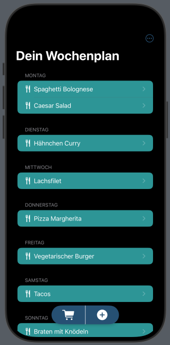
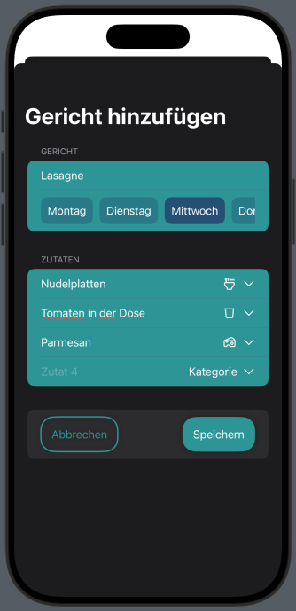
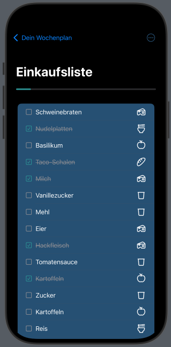

# Wochenplan

**Wochenplan** ist eine SwiftUI-basierte App, die Benutzern hilft, Mahlzeiten für die Woche zu planen und diese in einer Einkaufslisten zu verwalten.

## Funktionen

- **Wochenplan:**
  - Erstelle deinen Wochenplan mit mehreren Gerichten für jeden Wochentag.
  - Verschiebe Gerichte flexibel innerhalb eines Wochentages.
  - Leere dden Wochenplan und plane deine neue Woche.
  - Benutzerfreundliche Navigation mit einem Floating Action Button zum Öffnen der Einkaufsliste und hinzufügen neuer Gerichte.

- **Gerichte:**
  - Füge neue Gerichte hinzu und bearbeite bestehende.
  - Verwalte die Zutaten jedes Gerichts.

- **Zutaten:**
  - Kategorisiere Zutaten, z. B. nach Obst, Gemüse oder Fleisch.

- **Einkaufsliste:**
  - Gruppiere die Einkaugsliste nach Kategorien.
  - Markiere Zutaten als erledigt, um den Einkaufsprozess zu verfolgen.

- **Zusätzliche Funktionen:**
  - Umsetzung in Dark- und Light Mode.

## Installation

### Voraussetzungen
- macOS mit Xcode installiert (Version 15 oder höher).
- iOS-Gerät oder -Simulator mit iOS 17 oder höher.

### Schritte
1. Klone das Repository:
   ```bash
   git clone https://github.com/<Benutzername>/Wochenplan.git
   ```

2. Öffne das Projekt in Xcode:
   ```bash
   cd Wochenplan
   open Wochenplan.xcodeproj
   ```

3. Wähle ein Ziel (Simulator oder physisches Gerät) und baue das Projekt:
   ```bash
   xcodebuild -target Wochenplan -scheme Wochenplan
   ```

4. Starte die App auf dem Simulator oder deinem Gerät.

## Screenshots

| **Wochenplan** | **Gerichte** | **Einkaufsliste** |
|----------------|--------------|-------------------|
|  |  |  |

## Projektstruktur

- **Model:** Enthält die Datenmodelle wie `Gericht`, `Zutat`, `Wochentag` und `Kategorie`
- **ViewModel:** Die Logik zur Verwaltung der Daten und des Zustands, z. B. `WochenplanViewModel`.
- **Views:** Alle SwiftUI-Views wie `WochenplanView`, `GerichtDetailView` und `EinkaufslisteView`.

## Technologien

- **SwiftUI:** Moderne Benutzeroberflächenentwicklung für Apple-Plattformen.
- **SwiftData:** Datenmanagement und Persistenz.
- **MVVM-Architektur:** Saubere Trennung von Logik und UI.

## Mitwirken

Beiträge sind willkommen! So kannst du mitwirken:
1. Forke das Repository.
2. Erstelle einen neuen Branch:
   ```bash
   git checkout -b feature/neues-feature
   ```
3. Nimm deine Änderungen vor und commite sie:
   ```bash
   git commit -m "Neues Feature hinzugefügt"
   ```
4. Push deinen Branch:
   ```bash
   git push origin feature/neues-feature
   ```
5. Stelle einen Pull-Request.


## Autor

**Fabian Hofer**  
[GitHub-Profil](https://github.com/<Benutzername>)


---

Vielen Dank für dein Interesse an **Wochenplan**!

